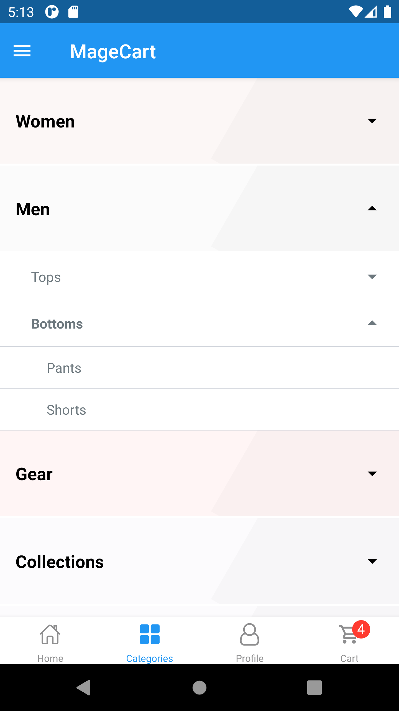
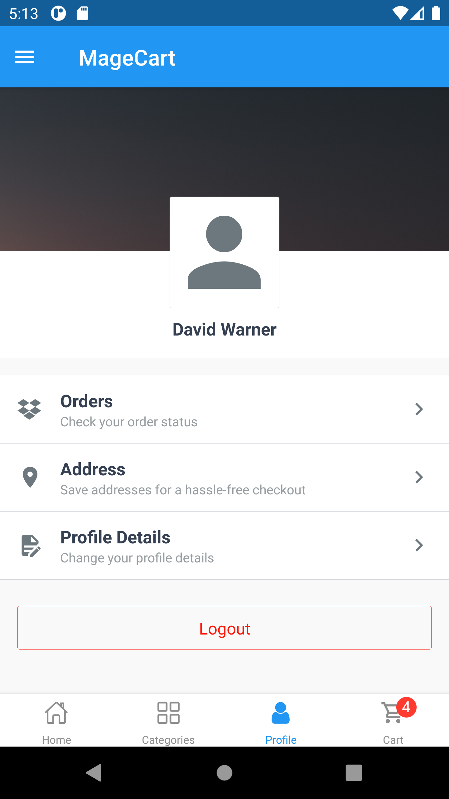
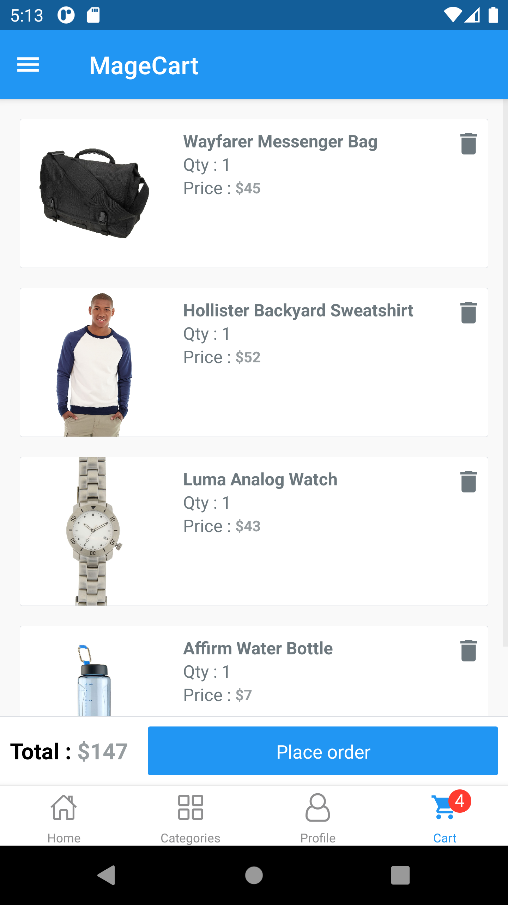
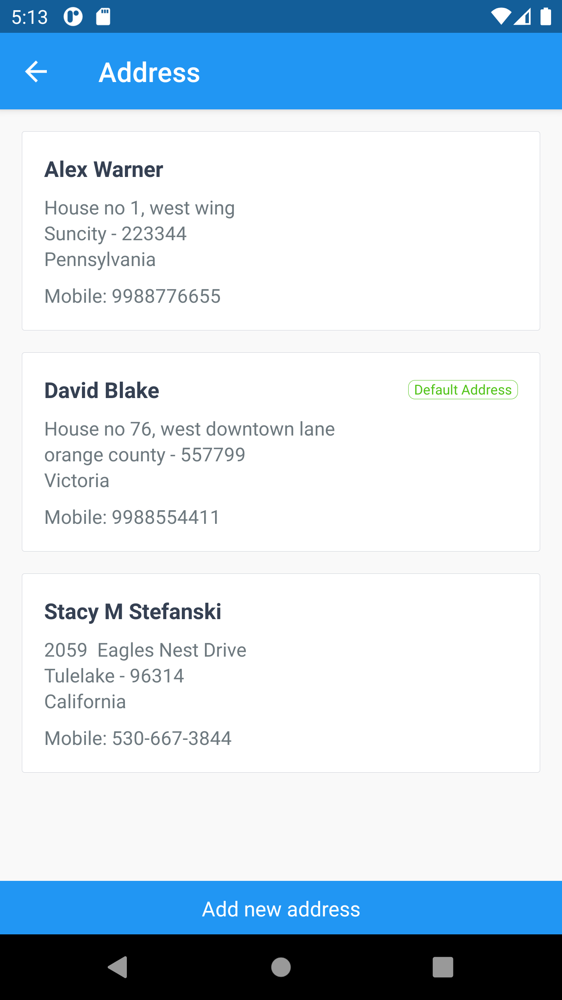
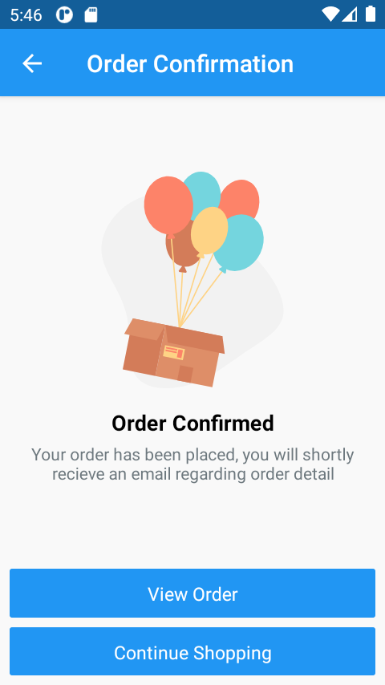
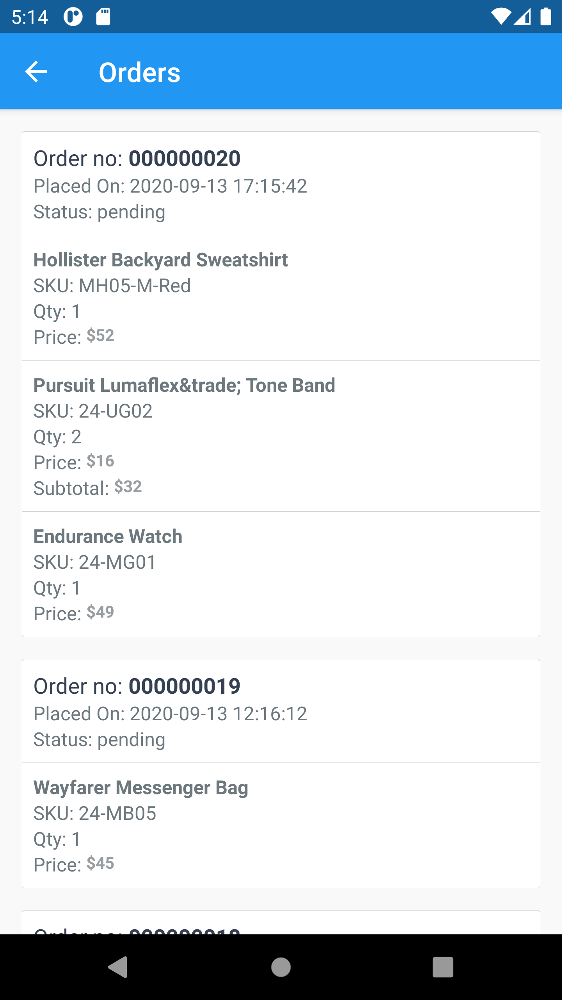

# MageCart : Magento 2 React Native eCommerce App

MageCart is an e-commerce app for Magento 2.1 onwards. It consumes [Magento 2 REST API](https://devdocs.magento.com/guides/v2.3/get-started/rest_front.html) to display catalog, products, add products to cart and let you place order.

## :camera: Screenshots

  
  
  
  
  

  
  
  
  
  

## 📲 Getting Started

Follow this [Documentation](https://github.com/jeriramadhan/reactmagent-punyacara/wiki/Setup) for detailed step by step instructions on how to setup project locally and run the project.

## 🙋‍ Contribute  

If you find a bug, or if you have an idea for this app, please file an issue [here](https://github.com/sanjeevyadavit/magento_react_native/issues). We really appreciate feedback and inputs!

🇬🇧🇫🇷🇪🇸🇨🇳 You may also contribute with translations with our online tool [crowdin](https://crwd.in/magento-react-native).

More information on contributing, head over to our [contribution guidelines](CONTRIBUTING.md). 

<!-- markdownlint-enable -->
<!-- prettier-ignore-end -->
<!-- ALL-CONTRIBUTORS-LIST:END -->

This project follows the [all-contributors](https://github.com/all-contributors/all-contributors) specification. Contributions of any kind welcome!

## 🛡 License

This project is licensed under the GNU v3 Public License License - see the [LICENSE.md](LICENSE.md) file for details.
